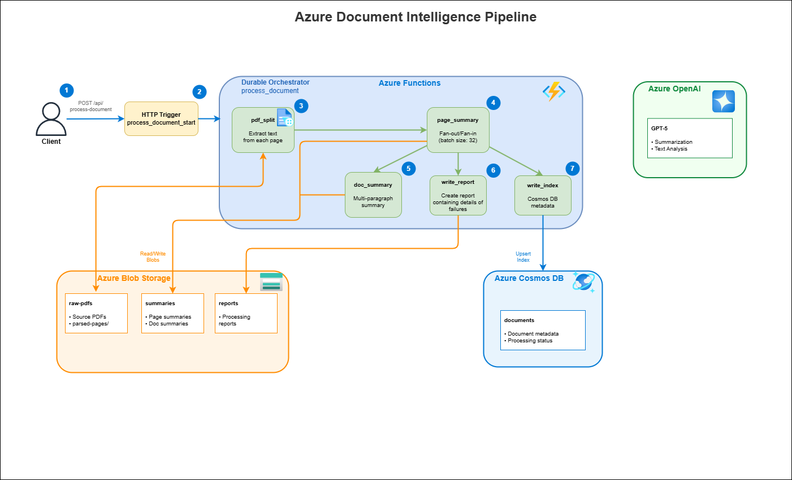

# 📄 Azure Document Intelligence Pipeline

A serverless **Azure Durable Functions** solution for processing PDF documents at scale. The pipeline uses **Azure Document Intelligence** (v4.0 GA) for text extraction with span-based content parsing, generates AI-powered summaries using **Azure OpenAI**, and persists results to **Azure Blob Storage** and **Azure Cosmos DB**.



---

## ✨ Features

| Feature | Description |
|---------|-------------|
| **Serverless & Durable** | Built on Azure Durable Functions with automatic checkpointing and retry |
| **Fan-out/Fan-in Pattern** | Process pages in parallel batches (default: 32 concurrent) |
| **OCR & Text Extraction** | Azure Document Intelligence v4.0 with `prebuilt-read` model for accurate text extraction from PDFs (supports up to 500 MB on paid tier) |
| **AI-Powered Summaries** | Per-page one-sentence summaries + multi-paragraph document summary |
| **Full Audit Trail** | All artifacts persisted to Blob Storage with metadata in Cosmos DB |
| **Identity-Based Auth** | Uses `DefaultAzureCredential` for Blob, Cosmos, and OpenAI |
| **Extensible** | Easy to add classification, additional analyzers, or custom processing steps |

---

## 🏗️ Architecture

```
┌─────────────────────────────────────────────────────────────────────────────┐
│                              Azure Functions                                 │
│  ┌──────────────┐    ┌─────────────────────────────────────────────────┐    │
│  │  HTTP Start  │───▶│            Durable Orchestrator                 │    │
│  │  (Trigger)   │    │                                                 │    │
│  └──────────────┘    │  ┌─────────┐   ┌──────────────┐   ┌─────────┐  │    │
│                      │  │pdf_split│──▶│ page_summary │──▶│   doc   │  │    │
│                      │  │         │   │  (fan-out)   │   │ summary │  │    │
│                      │  └─────────┘   └──────────────┘   └─────────┘  │    │
│                      │        │              │                │       │    │
│                      │        ▼              ▼                ▼       │    │
│                      │  ┌─────────────────────────────────────────┐   │    │
│                      │  │         write_report + write_index      │   │    │
│                      │  └─────────────────────────────────────────┘   │    │
│                      └─────────────────────────────────────────────────┘    │
└─────────────────────────────────────────────────────────────────────────────┘
         │                        │                          │
         ▼                        ▼                          ▼
┌─────────────────┐    ┌─────────────────┐         ┌─────────────────┐
│  Azure Blob     │    │  Azure OpenAI   │         │  Azure Cosmos   │
│  Storage        │    │  (GPT-4/5)      │         │  DB             │
│                 │    │                 │         │                 │
│ • raw-pdfs/     │    │ • Summarization │         │ • documents     │
│ • parsed-pages/ │    │ • Text Analysis │         │   container     │
│ • summaries/    │    │                 │         │                 │
│ • reports/      │    │                 │         │                 │
└─────────────────┘    └─────────────────┘         └─────────────────┘
```

### Pipeline Flow

1. **Upload** → Client uploads PDF to `raw-pdfs` container
2. **Trigger** → HTTP POST to `/api/process-document` starts orchestration
3. **Split** → `pdf_split` uses Azure Document Intelligence (prebuilt-read) with span-based extraction for accurate text extraction → `parsed-pages/`
4. **Summarize Pages** → `page_summary` runs in parallel batches → `summaries/{docId}/pages/`
5. **Summarize Document** → `doc_summary` creates final summary → `summaries/{docId}.json`
6. **Report** → `write_report` creates processing report → `reports/{docId}.json`
7. **Index** → `write_index` upserts metadata to Cosmos DB

---

## 📁 Project Structure

```
dur_func/
├── function_app.py          # Main entry point with all function definitions
├── activities/              # Activity implementations
│   ├── pdf_split_activity.py
│   ├── page_summary_activity.py
│   ├── doc_summary_activity.py
│   ├── write_report_activity.py
│   └── write_index_activity.py
├── utils/                   # Shared utilities
│   ├── storage_utils.py     # Blob Storage operations
│   ├── cosmos_utils.py      # Cosmos DB operations
│   ├── openai_utils.py      # Azure OpenAI client
│   ├── document_intelligence_utils.py  # Azure Document Intelligence SDK v1.0.0b4
│   └── content_understanding_utils.py  # Legacy (deprecated)
├── tests/                   # Unit tests
├── docs/                    # Documentation
│   ├── architecture.md
│   ├── architecture.drawio.svg
│   ├── function-flow.md
│   ├── setup.md
│   ├── deployment.md
│   ├── prompts.md
│   └── troubleshooting.md
├── regenerate_summaries.py  # Standalone summary regeneration tool
├── format_summary_markdown.py  # Markdown formatter for document summaries
├── host.json                # Functions host configuration
├── local.settings.json      # Local development settings
└── requirements.txt         # Python dependencies
```

---

## 🚀 Quick Start

### Prerequisites

- **Python 3.10+**
- **Azure Functions Core Tools v4**
- **Azure CLI** (logged in with `az login`)
- Azure resources:
  - Storage Account with containers: `raw-pdfs`, `summaries`, `reports`
  - Cosmos DB account with database and `documents` container
  - Azure OpenAI deployment (GPT-4 or GPT-4o recommended)
  - Azure Document Intelligence resource (S0 tier recommended for files up to 500 MB)

### 1. Clone and Setup

```bash
# Clone the repository
git clone <repository-url>
cd dur_func

# Create virtual environment
python -m venv .venv

# Activate (Windows)
.venv\Scripts\activate

# Activate (Linux/Mac)
source .venv/bin/activate

# Install dependencies
pip install -r requirements.txt
```

### 2. Configure Settings

Create `local.settings.json`:

```json
{
  "IsEncrypted": false,
  "Values": {
    "AzureWebJobsStorage__accountName": "<storage-account-name>",
    "FUNCTIONS_WORKER_RUNTIME": "python",
    "DOCUMENT_INTELLIGENCE_ENDPOINT": "https://<your-resource>.cognitiveservices.azure.com/",
    "DOCUMENT_INTELLIGENCE_KEY": "<your-key>",
    "AZURE_OPENAI_ENDPOINT": "https://<your-openai>.openai.azure.com/",
    "AZURE_OPENAI_DEPLOYMENT": "gpt-4",
    "AZURE_OPENAI_API_KEY": "<your-api-key>",
    "COSMOS_ENDPOINT": "https://<your-cosmos>.documents.azure.com:443/",
    "COSMOS_DB": "<database-name>",
    "BLOB_ACCOUNT_URL": "https://<storage-account>.blob.core.windows.net/",
    "OPENAI_MAX_CONCURRENCY": "32",
    "PAGE_SUMMARY_SENTENCES": "2"
  }
}
```

### 3. Run Locally

```bash
func start
```

### 4. Process a Document

Upload a PDF to the `raw-pdfs` container, then trigger processing:

```powershell
# PowerShell
$body = @{
    documentId = "my-document"
    blobPath = "raw-pdfs/my-document.pdf"
} | ConvertTo-Json

Invoke-RestMethod -Uri "http://localhost:7071/api/process-document" `
    -Method POST -Body $body -ContentType "application/json"
```

```bash
# Bash/curl
curl -X POST http://localhost:7071/api/process-document \
  -H "Content-Type: application/json" \
  -d '{"documentId": "my-document", "blobPath": "raw-pdfs/my-document.pdf"}'
```

The response includes status URLs to monitor progress:

```json
{
  "id": "abc123...",
  "statusQueryGetUri": "http://localhost:7071/runtime/webhooks/durabletask/instances/abc123...",
  "sendEventPostUri": "...",
  "terminatePostUri": "...",
  "purgeHistoryDeleteUri": "..."
}
```

---

## 📊 Output Artifacts

### Blob Storage

| Container | Path | Description |
|-----------|------|-------------|
| `raw-pdfs` | `{filename}.pdf` | Source PDF documents |
| `raw-pdfs` | `parsed-pages/{docId}/{page}.json` | Extracted text per page |
| `summaries` | `{docId}/pages/{page}.json` | One-sentence page summaries |
| `summaries` | `{docId}.json` | Multi-paragraph document summary |
| `reports` | `{docId}.json` | Processing report with success/failure counts |

### Cosmos DB Document

```json
{
  "id": "my-document",
  "documentId": "my-document",
  "fileName": "my-document.pdf",
  "blobPath": "raw-pdfs/my-document.pdf",
  "pageCount": 8,
  "failedPageCount": 0,
  "summaryBlob": "my-document.json",
  "reportBlob": "my-document.json",
  "status": "completed",
  "createdAt": "2025-11-25T17:04:16.871Z",
  "updatedAt": "2025-11-25T17:04:16.871Z"
}
```

---

## ⚙️ Configuration

| Environment Variable | Description | Default |
|---------------------|-------------|---------|
| `AZURE_OPENAI_ENDPOINT` | Azure OpenAI endpoint URL | Required |
| `AZURE_OPENAI_DEPLOYMENT` | Model deployment name | Required |
| `AZURE_OPENAI_API_KEY` | API key (or use Managed Identity) | Required |
| `COSMOS_ENDPOINT` | Cosmos DB endpoint URL | Required |
| `COSMOS_DB` | Cosmos DB database name | `docsum` |
| `BLOB_ACCOUNT_URL` | Blob Storage account URL | Required |
| `OPENAI_MAX_CONCURRENCY` | Max parallel page summaries | `32` |
| `PAGE_SUMMARY_SENTENCES` | Sentences per page summary | `2` |

---

## 🔐 Authentication

The pipeline uses **`DefaultAzureCredential`** for Azure services, which supports:

1. **Local Development**: `az login` credentials
2. **Azure Deployment**: Managed Identity

### Required RBAC Roles

| Service | Role |
|---------|------|
| Storage Account | Storage Blob Data Contributor |
| Storage Account | Storage Queue Data Contributor |
| Storage Account | Storage Table Data Contributor |
| Cosmos DB | Cosmos DB Built-in Data Contributor |
| Azure OpenAI | Cognitive Services OpenAI User |

---

## 🧪 Testing

```bash
# Run all tests
pytest

# Run with coverage
pytest --cov=. --cov-report=html

# Run specific test file
pytest tests/test_page_summary.py -v
```

---

## 🚢 Deployment

See [docs/deployment.md](./docs/deployment.md) for full deployment instructions.

Quick deploy with Azure CLI:

```bash
# Create Function App
az functionapp create \
  --resource-group <rg-name> \
  --consumption-plan-location <region> \
  --runtime python \
  --runtime-version 3.11 \
  --functions-version 4 \
  --name <function-app-name> \
  --storage-account <storage-name>

# Deploy code
func azure functionapp publish <function-app-name>
```

---

## 🔧 Helper Tools

### Summary Regeneration (`regenerate_summaries.py`)

Standalone tool to regenerate summaries without reprocessing PDFs. Useful for:
- Fixing empty summaries caused by token limit issues
- Re-running summaries with updated prompts
- Selective page regeneration

**Usage:**
```bash
# Regenerate all summaries for a document
python regenerate_summaries.py timken-v5

# Regenerate specific page range
python regenerate_summaries.py timken-v5 --pages 1-50

# Dry-run to check what would be processed
python regenerate_summaries.py timken-v5 --dry-run

# Process all documents
python regenerate_summaries.py --all
```

**Features:**
- Parallel processing (32 concurrent workers by default)
- Progress tracking with success/skipped/failed counts
- Direct activity calls (bypasses orchestrator for faster execution)
- Supports partial regeneration with `--pages` flag

### Markdown Formatter (`format_summary_markdown.py`)

Converts document summaries from blob storage into well-formatted markdown files.

**Usage:**
```bash
# Format a single document summary
python format_summary_markdown.py timken-v5

# Custom output path
python format_summary_markdown.py timken-v5 --output reports/timken.md

# Executive summary only (no page details)
python format_summary_markdown.py timken-v5 --no-pages

# Format all documents in batch
python format_summary_markdown.py --all --output-dir markdown_summaries/
```

**Output includes:**
- Status badges (✅ Success / ❌ Failed)
- Executive summary from document-level analysis
- Page-by-page summaries with statistics
- Metadata (page counts, blob paths, timestamps)
- Error details for failed processing

---

## 📚 Documentation

- [Architecture Overview](./docs/architecture.md)
- [Function Flow](./docs/function-flow.md)
- [Prompts & Summarization](./docs/prompts.md)
- [Local Setup](./docs/setup.md)
- [Deployment Guide](./docs/deployment.md)
- [Troubleshooting](./docs/troubleshooting.md)

---

## 🛠️ Troubleshooting

| Issue | Solution |
|-------|----------|
| `max_tokens` error | Use `max_completion_tokens` for GPT-5 models |
| `temperature` error | GPT-5 only supports default temperature (1) |
| Cosmos 404 error | Ensure database and container exist with correct partition key |
| Storage auth error | Run `az login` or check RBAC roles |

See [docs/troubleshooting.md](./docs/troubleshooting.md) for more.

---

## 📄 License

MIT License - see [LICENSE](./LICENSE) for details.
